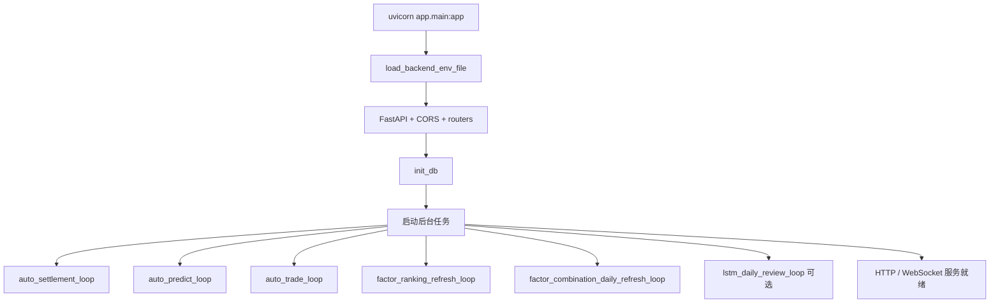
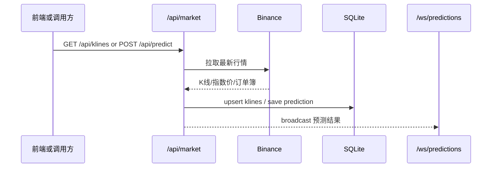
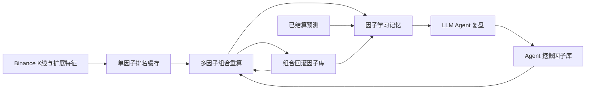

# incidentSpot 后端流程总览

本文基于 `backend/app/main.py`、`backend/app/api/*`、`backend/app/services/*` 整理，目标是把后端的运行逻辑、主数据流和闭环回写点一次讲清楚。

## 1. 系统定位

后端围绕四类核心对象运行：

- 行情数据：Binance 指数价、指数 K 线、订单簿、近期成交
- 事件合约：手动事件、快速事件、订单、结算
- 因子体系：单因子排名、多因子组合排名、挖掘因子库、学习记忆
- 策略执行：规则预测、自动交易、多模型族训练/预测、每日复盘

整体原则是：

- 真实数据优先，不伪造成功
- 失败显式暴露到日志、接口返回或状态文件
- 所有回写都要落库或落文件，保证下一轮能读到

## 2. 启动与运行时序



启动命令在仓库根目录的 `启动明亮` 中定义：

```powershell
uvicorn app.main:app --host 0.0.0.0 --port 8000 --reload
```

启动后会做这些事：

1. 读取 `.env` 及后端环境变量。
2. 初始化 FastAPI、CORS 和所有路由。
3. 执行 `init_db()`，创建或迁移 `backend/data.db`。
4. 创建并挂起后台协程任务。
5. 退出时先发 stop event，再等待任务自然收尾。

数据库入口在 `backend/app/db/session.py`，核心持久化就是 SQLite 文件 `backend/data.db`。

## 3. 对外接口总览

### `/api/market`

行情与规则预测入口：

- `GET /api/last-price`
- `GET /api/depth`
- `GET /api/agg-trades`
- `GET /api/index-price`
- `GET /api/index-klines`
- `GET /api/klines`
- `POST /api/predict`
- `GET /api/predict/latest`
- `POST /api/predict/10m`

职责分两层：

- 行情读取：从 Binance 拉取并在必要时写入 `klines`
- 规则预测：刷新最新 1m K 线后调用 `predict_rule_direction`

### `/api/events`

事件合约与结算入口：

- `GET /api/events`
- `POST /api/events`
- `DELETE /api/events`
- `POST /api/events/quick-trade`
- `POST /api/events/{event_id}/orders`
- `POST /api/events/{event_id}/settle`

### `/api/rules`

- `GET /api/rules/backtest`

### `/api/factors`

- `GET /api/factors/list`
- `GET /api/factors/detail/{factor_name}`
- `GET /api/factors/backtest/all`
- `GET /api/factors/backtest/{factor_name}`
- `GET /api/factors/ranking`
- `POST /api/factors/ranking/refresh`
- `GET /api/factors/categories`

### `/api/factors/combinations`

- `GET /api/factors/combinations/ranking`
- `GET /api/factors/combinations/signals`
- `POST /api/factors/combinations/refresh`
- `GET /api/factors/combinations/positions`

### `/api/factor-learning`

- `GET /api/factor-learning/memory`
- `POST /api/factor-learning/refresh`
- `POST /api/factor-learning/agent/review`
- `GET /api/factor-learning/operators`
- `GET /api/factor-learning/mined-library`

### `/api/models/{family}`

- `GET /api/models/{family}/status`
- `POST /api/models/{family}/train`
- `POST /api/models/{family}/candidate-search`
- `GET /api/models/{family}/predict`

### `/api/auto-trade`

- `GET /api/auto-trade/settings`
- `GET /api/auto-trade/status`
- `GET /api/auto-trade/strategies`
- `PUT /api/auto-trade/settings`
- `PUT /api/auto-trade/strategies/{strategy_key}`

### WebSocket

- `WS /ws/predictions`
- `WS /ws/klines`
- `WS /ws/index-klines`

### 健康检查

- `GET /health`

## 4. 行情与预测主链路



### 4.1 K 线读取

- `GET /api/klines?live=false` 先读本地 `klines`
- 如果本地样本不足，就回源 Binance 并写回数据库
- `live=true` 时直接拉 Binance REST，再 upsert 本地

### 4.2 规则预测

`POST /api/predict` 和后台 `auto_predict_loop` 都会走同一套预测内核：

1. 刷新最新 1m K 线
2. 刷新策略周期 K 线
3. 找出当前可预测的策略配置
4. 调用 `predict_rule_direction`
5. 写入 `predictions` 表
6. 广播到 `WS /ws/predictions`

`prediction_cache_service` 会按 `strategy_key + symbol + duration + open_time` 做去重，避免同一窗口重复写入。

### 4.3 自动预测循环

`auto_predict_loop` 每秒轮询一次，但不是盲扫，它先判断当前是否到了各策略的入场窗口。真正执行时会：

- 预热 1m 和策略周期 K 线
- 先结算到期预测
- 再执行高胜率策略降级评估
- 之后才产出新预测

如果策略是因子组合策略，还会额外写入：

- 因子组合 sidecar 预测
- 批量模拟交易记录

如果策略是 LSTM shadow 策略，还会写入 LSTM shadow 预测。

## 5. 事件交易与结算闭环

```mermaid
sequenceDiagram
    participant UI as 前端或调用方
    participant API as /api/events
    participant DB as SQLite
    participant LOOP as auto_settlement_loop
    participant BIN as Binance premiumIndex

    UI->>API: POST /api/events 或 /quick-trade
    API->>DB: 写入 events / orders
    LOOP->>DB: 扫描 OPEN 且已到 endTime 的事件
    LOOP->>BIN: 拉取结算价
    BIN-->>LOOP: indexPrice / quoteTime
    LOOP->>DB: 写 settlements 并更新 event 为 SETTLED
```

### 5.1 事件创建

- `POST /api/events`：创建普通事件，默认 `MANUAL_STRATEGY_KEY`
- `POST /api/events/quick-trade`：一次性创建事件 + 订单上下文
- `POST /api/events/{event_id}/orders`：给已有事件补订单

创建事件时会写入：

- `strategy_key`
- `symbol`
- `event_interval`
- `rule_type`
- `strike_value`
- `end_time`
- AI 预测和质量字段

### 5.2 订单与结算

`settlement_service.settle_event()` 的执行顺序是固定的：

1. 读取事件
2. 校验是否已到 `endTime`
3. 优先用 Binance `premiumIndex` 取实时结算价
4. 如果实时失败，再回退到本地保存的指数价 tick
5. 根据 `rule_type` 计算 YES / NO
6. 对关联订单逐笔写入 `settlements`
7. 更新事件状态为 `SETTLED`
8. 记录 `ai_prediction_correct`

这里没有静默降级为“成功”。如果数据缺失，会直接抛错并记录日志。

### 5.3 自动结算循环

`auto_settlement_loop` 会持续扫描所有 `OPEN` 事件中已到期的记录，然后逐个调用 `settle_event()`。

这条循环是事件闭环的收口：  
事件创建后只要到了结算时间，系统会自动把结果写回数据库。

## 6. 因子排名、组合搜索与学习闭环



### 6.1 单因子排名

`factor_ranking_refresh_loop` 会按配置的 `factor_ranking_precomputed_symbols()` 周期性刷新单因子排名缓存。

它的职责很单一：

- 计算
- 写缓存
- 不做额外业务判断

接口 `POST /api/factors/ranking/refresh` 可以手动触发单个 symbol 或单个 duration 的重算。

### 6.2 多因子组合重算

`POST /api/factors/combinations/refresh` 会把组合重算排到后台任务里。真正的重算流程在 `factor_combination_background.refresh_combination_ranking_for_symbol_duration()`：

1. 拉最新 K 线并补齐缺失区间
2. 运行多因子组合排名
3. 写入组合缓存
4. 把达标组合晋升到组合回灌因子库 `mined_factor_library`
5. 同步 LSTM shadow 模型与组合排名快照
6. 刷新因子学习记忆
7. 刷新组合信号 watchlist 缓存

`mined_factor_library` 不是 Agent 挖出来的单因子库。它保存的是历史表现达标的多因子组合，并把这些组合包装成下一轮组合搜索可复用的候选基础因子。

### 6.3 因子学习记忆

`refresh_factor_learning_memory()` 会把下面几类信号合并成一份学习记忆：

- 当前组合排名
- 已结算预测
- 组合回灌因子库
- Agent 单因子库
- 组合监控报告
- LSTM shadow 结果
- 亏损模式和过滤规则

其中“成功模式”和“禁区”会读取上一版 memory 后做历史合并：新出现的项写入，重复出现的项累加 `support` 并更新聚合指标，旧项不会因为本次窗口没出现就被删除。

记忆文件落在：

- `backend/models/factor_learning/<symbol>_<duration>.json`

### 6.4 LLM Agent 复盘

`POST /api/factor-learning/refresh?runAgent=true` 或 `POST /api/factor-learning/agent/review` 会触发 Agent 复盘。

Agent 的输出不会直接当成事实，它提出的是候选单因子公式，随后会进入：

- `process_agent_factor_candidates`
- `agent_mined_factor_library`
- 复盘历史

如果 Agent 处理失败，状态会被写成 `failed`，不会假装成功。

### 6.5 下一轮如何吃到上一次的结果

下一轮组合搜索会继续读取：

- `mined_factor_library`：组合回灌因子
- `agent_mined_factor_library`：Agent 单因子
- 当前因子学习记忆
- 已结算预测和监控结果

也就是说，这条链路是闭环而不是单次离线分析。

## 7. 多模型族闭环

LSTM 相关流程分成三层：

1. 手动训练
2. 预测服务
3. 日常复盘和快照同步

### 7.1 手动训练

`POST /api/models/{family}/train` 会根据 `profile`、模型族和参数生成训练配置，再调用统一模型族训练服务。

SVM 模型族使用可扩展 hinge-loss 实现：线性核走 `SGDClassifier(loss="hinge")`，RBF 核走 `RBFSampler + SGDClassifier`。这样候选搜索仍执行真实 SVM 决策函数训练，但不会在全量序列窗口上被精确核求解器长时间阻塞。

### 7.2 预测与状态

- `GET /api/models/{family}/predict`：输出预测结果
- `GET /api/models/{family}/status`：输出模型状态、候选库和 shadow 阻断原因

### 7.3 组合快照同步

`sync_lstm_model_to_combo_ranking()` 用来把 LSTM 模型和当前组合排名快照对齐：

- 如果模型和快照一致，直接返回 `up_to_date`
- 如果 artifacts 已过期或快照不同，就重新训练
- 如果已有训练尝试且状态终态匹配当前快照，就保持原结果

### 7.4 每日复盘

`lstm_daily_review_loop` 默认按 `Asia/Shanghai` 时区、`02:00` 执行，是否开启由 `LSTM_DAILY_REVIEW_ENABLED` 控制。

复盘动作包括：

- 重新跑组合排名
- 晋升组合
- 训练 LSTM
- 刷新因子学习记忆
- 可选运行 LLM Agent

如果 PyTorch 不可用，循环会明确记录 warning，然后等下一次调度，不会伪造训练完成。

### 7.5 Shadow 学习

`lstm_shadow_learning_summary()` 会把 LSTM shadow 策略的已结算预测与组合策略做对比，结果会被纳入因子学习记忆。

## 8. 自动交易闭环

`auto_trade_loop` 每 1 秒执行一次，核心判定顺序是：

1. 策略是否启用
2. 是否已有未平仓位
3. 是否存在最新预测
4. 是否属于当前入场窗口
5. 预测是否足够新
6. 预测是否可交易
7. 满足后创建事件/订单

`create_trade_from_prediction()` 会：

- 拉最新指数价
- 根据方向决定 BUY 或 SELL
- 构造 quick-trade payload
- 写入本地事件和订单记录

模型族 shadow 策略默认启用 `10m` 和 `60m` 模拟实盘槽位，覆盖 LSTM、GRU、CNN、Transformer、RandomForest、XGBoost、SVM、QTable 方向分类器、Bayesian、KNN。`rl_strategy` 仅作为历史策略 key 保留；当前实现不是完整 RL 环境。后端会强制这些模型族策略保持 `live_trading_enabled = false`，只写本地模拟事件/订单；预测结算会进入学习记忆和后续训练输入。

`GET /api/auto-trade/status` 会把每个策略的：

- 最新预测
- 是否有开仓位
- 高胜率状态
- 拒绝原因

统一展开给前端。

## 9. 状态与存储

### SQLite

`backend/data.db` 保存这些主状态：

- `klines`
- `predictions`
- `events`
- `orders`
- `settlements`
- `auto_trade_settings`
- `auto_trade_strategies`
- 各类 factor ranking cache
- high winrate status

### 文件型状态

- 因子学习记忆：`backend/models/factor_learning/*.json`
- 挖掘因子库与 Agent 库：同一模型目录下的持久化 JSON
- 规则回测与策略政策：`backend/rules/*.json`

## 10. 失败暴露与回退规则

项目不做静默兜底，常见表现如下：

- 参数不合法：返回 `400`
- 上游 Binance 失败：返回 `502`
- WebSocket interval 不支持：直接关闭连接，代码 `1008`
- 后台任务异常：写 `logger.exception`
- 缺少模型或依赖：明确抛错，不伪造成成功

这保证了闭环中的断点会暴露出来，而不是被“看起来能跑”的假状态盖住。

## 11. 相关文件

- `backend/app/main.py`
- `backend/app/api/*.py`
- `backend/app/services/*.py`
- `backend/app/db/session.py`
- `backend/docs/factor_learning_closed_loop.md`
- `backend/docs/quant_factor_research.md`
